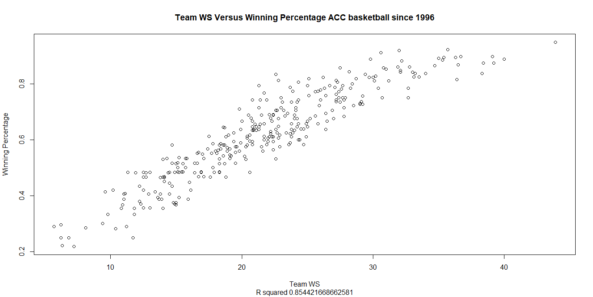

\openup 1em

```{r setup, include=FALSE}
knitr::opts_chunk$set(echo = TRUE)
```

```{r, echo = F, eval = T, include=F}
library(readr)
library(tidyverse)
library(caret)
library(caretEnsemble)


data = read_csv('~/Honors Thesis/Clean Data/espn.bball-ref.aau.prep.csv')


#2 wrong players scraped#
data = data %>% dplyr::filter(Season != 1993 & Season != 2014)


# this prior hypothesis is no longer believed to be true:
# # adding in recreated per game prep stats 
# as given per game statistics are inaccurate

# data = data %>% mutate(
#   ppg.actual.prep = c(PTS.prep / gp.max.prep),
#   mpg.actual.prep = c(MIN.prep / gp.max.prep),
#   blkg.actual.prep = c(BLK.prep / gp.max.prep),
#   stlg.actual.prep = c(STL.prep / gp.max.prep),
#   astg.actual.prep = c(AST.prep / gp.max.prep),
#   tov.actual.prep = c(TO.prep / gp.max.prep),
#   rebg.actual.prep = c(REB.prep / gp.max.prep),
#   `3pmg.actual.prep` = c(`3PM.prep` / gp.max.prep),
#   fgmg.actual.prep = c(FGM.prep / gp.max.prep),
#   ftmg.actual.prep = c(FTM.prep / gp.max.prep),
#   `3pm.actual.prep` = c(`3PM.prep` * `3P%.prep`),
#   fgm.actual.prep = c(FGM.prep * fg.prep),
#   ftm.actual.prep = c(FTM.prep * `FT%.prep`)
# )


data$group <- ifelse(is.na(data$ppg.prep) & !is.na(data$pts.aau),
                      'Only AAU', NA)


data$group <- ifelse(!is.na(data$ppg.prep) & is.na(data$pts.aau),
                      'Only Prep',
                      data$group)


data$group <- ifelse(!is.na(data$ppg.prep) & !is.na(data$pts.aau),
                      'Prep and AAU',
                      data$group)


data$group <- ifelse(is.na(data$group),
                      'Neither',
                      data$group)


data = data %>% group_by(Season, group) %>% mutate(group.num = n())


# ggplot(boxplots, aes(y = ws, x = group)) + 
#   geom_boxplot(aes(group = group),
#                colour = 'skyblue') + 
#   theme_bw() + 
#   facet_grid(rows = vars(Season)) + ggtitle('WS by Amount of Data')


# ggplot(data, aes(y = ws)) + 
#   geom_violin(aes(x = group),
#               colour = 'skyblue') + 
#   theme_bw() + 
#   facet_grid(rows = vars(Season)) + 
#   ggtitle('WS by Amount of Data')

group.freq = unique(data[, c('Season', 'group', 'group.num')])
colnames(group.freq) = c('Season', 'Partition', 'Freq')
group.freq = group.freq[order(-group.freq$Freq),]

data.by.season = ggplot(group.freq, aes(Partition,  Freq)) + 
  geom_bar(stat = 'identity',
           fill = 'skyblue') + 
  theme_bw() + theme(panel.grid.major.x = element_blank(),
                     panel.grid.minor.y = element_blank()) + 
  facet_grid(rows = vars(Season)) + 
  ggtitle('Data Availability by Season') + 
  ylab('Number of Players') + 
  xlab('')
```


```{r, echo = F, eval = T, include=F}


group.freq  = spread(group.freq, Partition , Freq)

group.freq[is.na(group.freq)] = 0

library(pander)
```


# Introduction

The goal of this project is to predict collegiate win shares from ESPN recruiting ratings [1] and high school statistics provided by Prep Circuit [2] and AAUStats [3]. As it stands, there is little research on predicting individual players’ collegiate performance. In 2010, Jamie McNeilly used recruiting ranking quartiles to predict PER and other barometers of success [3]; however, the models presented did not consider high school statistics as an input, nor did they consider predicting win shares, which is a more authentic measurement of how a player contributes to overall team success as shown by basketball reference [5].  
Accusations of many NCAA coaches paying high profile recruits hundreds of thousands of dollars to single recruits catalyized this analysis. If one player can cause decorated coaches to potentially resort to unethical methods, then programs should explore every possible avenue of predicting college performance, especially programs with smaller budgets and less recognition.  
In addition to benefiting collegiate programs, the methods in this paper could benefit NBA front office decision making. Some high-profile recruits have had mediocre freshman collegiate performances (Harry Giles), or hardly any at all (Michael Porter Jr., Thon Maker), and are still selected in the first round based on their high school evaluations. As NBA teams are investing millions of dollars on players with little to no collegiate data, the methods and data presented in this paper could be used to model NBA performance in conjunction with their collegiate performance.  
The model with the best out-of-sample mean absolute error included both ESPN ratings and Prep Circuit statistics. The models with only ESPN rating and only Prep Circuit statistics followed suit. Future research adjusting for players’ strength of schedule and teamates could significantly improve the models presented in this paper. 

# Data 
## Basketball Reference
Every statistic listed on a player’s college basketball reference page was collected; however, only a player’s first season playing in the NCAA was used in the modeling process in order to fairly evaluate a player’s true production out of high school. Due to its all- encompassing nature, win shares represents the dependent variable. Below is a graph of ACC teams’ sum of player win shares plotted against their season winning percentage. 
```{r, echo = F, fig.align = 'center', out.height='100%', out.width='100%'}

```

  College win shares have a weaker relationship with winning than WAR in baseball and in the NBA partially due to large differences in league competition; nonetheless, it is a strong predictor of team success as shown by the above R-squared and basketball reference’s analysis [5]. To further justify the use of win shares as the response, below are the top 10 players in terms of win shares in our data.
```{r, echo = F, eval = T, include=F}
top.ws = data %>% arrange(desc(ws)) %>% select(Name, ws, Season)
top.10.ws = top.ws[1:10,]
```
`r pander(top.10.ws)`
From a basketball perspective, these players arguably had some of the best seasons over the past few years, and Zion in particular has been widely regarded as having the best season from a statistical and basketball perspective. This gives more confidence and validitiy to win shares as an overall barometer of success.

## ESPN
  The ESPN data gathered contained players’ overall rating from 55 to 100. Only the classes from 2016 to 2018 were used in this analysis due to the lack of Prep Circuit data before the 2016 high school season. In terms of grabbing the basketball reference data, the ESPN data played a critical role. There was no feasible or swift way to accurately gather a high school player’s collegiate win shares without knowing where he went to college, which was not in the Prep Circuit data. Also gathered from ESPN were players' height, weight, and position. 
  
## Prep Circuit
  
  The high school statistics gathered from Prep Circuit contained regular season averages and totals from box score statistics such as points, points per game, assists, etc. The data is fairly encompassing; however, there appear to be some inaccuracies in the data. For example, Lonzo Ball had 31 games where points were tracked, 4 games for minutes, 22 games for assists steals and turnovers, and 21 games for rebounds. One explanation is that Prep Circuit does not keep track of all statistics for every game. The other hypothesis was that if a player did not log a statistic in a given table, Prep Circuit did not count that towards your game total for that statistic. Upon futher inspection, it appeared that the most reliable statistics were the given per game statistics. 
  
## AAUStats  
  
  AAU data was gathered from aaustats.com [3]. This data contained box scores from Nike, Adidas, and Under Armour circuits from the 2017 to 2019 seasons. There is potential to create more advanced metrics with these box scores, or scaling based on the quality of a player's team or opponent; however, for this analysis, common per game box score statistics akin to Prep Circuit's data were created based on player's final season in all AAU circuits. 
  
  Prior analyses used k nearest neighbor imputation to deal with players missing a given statistic, such as rebounds in Prep Circuit. Below is a table of the number of Prep Circuit players that had points per game, but were missing another per game statistics.
```{r, echo = F, fig.align = 'center'}
Prep_NA_Counts <- read_csv("Prep.NA.Counts.csv")
colnames(Prep_NA_Counts)[1] = 'Per Game Statistic'
```
`r pander(Prep_NA_Counts)`
  
  Although this knn imputation was effective for seasons past, it will not be the best method going forward, as the amount and quality of data has improved drastically over the past few years. Below is a table and histogram of the number of players that have each of our data sources by season.
`r pander(group.freq)`
```{r, echo = F, fig.align = 'center', out.height='80%', out.width='70%'}
data.by.season
```

  As shown by the graph above, in 2016, the data sources presented did not even exist. By 2019, most ESPN rated players had both AAU and Prep Circuit statistics. This includes players that are rated poorly. Additionally, by the time this project will complete, the 2019-2020 college basketball season will be over. Their data could be incorporated into the training set or held out as a test set. 
  
# Models
  In order to assess the predictive value of high school statistics, several different models will be constructed using different sources of information. As shown by the graph above, not every model can be considered on every player as not all players have all sources of information. Therefore, for a given model, only players with complete information will be considered. The models are the following:
  
  
  \[M_{AAU}:=  \hat{ws} = f_{AAU}(X_{AAU})*gp_{bball-ref}+ \epsilon\]
  \[M_{PREP}:= \hat{ws} = f_{PREP}(X_{PREP})*gp_{bball-ref} + \epsilon\]
  \[M_{ESPN}:= \hat{ws} = f_{ESPN}(X_{ESPN})*gp_{bball-ref} + \epsilon\]
  \[M_{FULL}:= \hat{ws} = f_{FULL}(X_{AAU},X_{PREP}, X_{ESPN})*gp_{bball-ref} + \epsilon \]
where
\begin{itemize}
\item $\hat{ws}\:is\:the\:predicted\:win\:shares\:of\:a\:given\:player,$
\item  $X_{AAU},\:X_{Prep},\:and\:X_{ESPN}\:are\:the\:data\:matrices\:for\:each\:data\:source,$
\item $f_{AAU},\:f_{Prep},\:f_{ESPN},\:and\:f_{FULL}\:are\:functions\:that\:output\:predicted\:win\:shares\:per\:game\:using\:one\:or\:all\:three\:data sources,$
\item $gp_{bball-ref}\:is\:the\:number\:of\:games\:played\:in\:a\:player's\:first\:season,$
\item $\epsilon\:is\:a\:random\:error$
\end{itemize}


# Methodology
## Basic Linear Regression

  Many methods will be considered for each model, but to start, linear models will be considered as they are the most interpretable. First and foremost, deciphering which variables are of interest, and where the variation in the data lies will lead to better predictive modeling. To evaluate the predictive value of the data and each variable, a full linear regression was trained using leave one out cross validation using only either complete AAU data or Prep Circuit statistics. Win shares per game was the response variable. The predictions by the number of games played by the player. This allows for players who suffered injuries to be used in modeling, but not decrease the accuracy of the results. Below are the summary statistics for the linear $M_{AAU}$.

```{r, echo = F, eval = T, include=F}


# data = data %>% dplyr::select(-g)

data = data %>% dplyr::select(-total.given.pts.aau,
                              -given.pts.aau)


data$ws.per.game = data$ws / data$g


colnames(data)[colnames(data)=="fixed.height"] <- "Height"


#data = data[ , colSums(is.na(data)) == 0]

#data[is.na(data)] = 0


#data$Season = ifelse(data$Season == 2019, 1, 0)

# data = data %>% select(-ows, -dws,
#                        -Season)


#AAU PTS PER MIN
data$pts.per.min.aau = data$total.pts.aau / data$total.mp.aau


#need to justify later
data$pts.per.min.aau = ifelse(is.infinite(data$pts.per.min.aau),
                              NA,
                              data$pts.per.min.aau)

#HIGH SCHOOL POINTS

data$total.pts.high.school = data$PTS.prep + data$total.pts.aau

data$ppg.high.school = (data$total.pts.high.school) /
  (data$gp.ppg.prep + data$total.games.aau)

data$mean.pts.high.school = (data$ppg.prep + data$pts.aau) / 2


#HIGH SCHOOL REBOUNDS

data$total.rebs.high.school = data$REB.prep + data$total.reb.aau

data$rebs.high.school = data$total.rebs.high.school /
  (data$total.games.aau + data$gp.reb.prep)


#HIGH SCHOOL BLOCKS

data$total.blks.high.school = data$blk.aau + data$BLK.prep

data$blks.high.school = data$total.blks.high.school /
  (data$total.games.aau + data$gp.misc.prep)


#HIGH SCHOOL STEALS

data$total.stls.high.school = data$STL.prep + data$total.stl.aau

data$stls.high.school = data$total.stls.high.school /
  (data$total.games.aau + data$gp.misc.prep)


#HIGH SCHOOL FTs

data$total.fts.high.school = data$FTM.prep + data$total.ft.made.aau

data$fts.high.school = data$total.fts.high.school /
  (data$total.games.aau + data$gp.ppg.prep)


#HIGH SCHOOL MAX

# my.max = function(x) {
#   return(max(x, na.rm = T))
# }
# 
# data$max.pts.high.school = apply(X = data[, c('HIGH.prep', 'max.pts.aau')],
#                                  FUN = my.max,
#                                  MARGIN = c(1))
# 
# 
# data$max.pts.high.school = ifelse(is.infinite(data$max.pts.high.school),
#                                   NA,
#                                   data$max.pts.high.school)


#HIGH SCHOOL tos

data$total.tos.high.school = data$TO.prep + data$total.to.aau

data$tovs.high.school = data$total.tos.high.school /
  (data$total.games.aau + data$gp.misc.prep)


#HIGH SCHOOL 3ps

data$total.3ps.high.school = data$`3PM.prep` + data$threep.made.aau

data$`3ps.high.school` = data$total.3ps.high.school /
  (data$total.games.aau + data$gp.ppg.prep)

#data[,7:ncol(data)][data[,7:ncol(data)] == 0] <- NA


data = data %>% dplyr::select(Name,
                              player.id,
                              Position,
                              ws,
                              ows,
                              dws,
                              Season,
                              everything())

data$GamesPlayed.prep = data$gp.max.prep

data$GamesPlayed.aau = data$total.games.aau

data = data[, which(grepl('gp.', colnames(data)) == 0)]


data$Position.Basic = ifelse(data$Position %in% c('PG', 'SG'),
                       'G', 0)

data$Position.Basic = ifelse(data$Position %in% c('SF', 'PF'),
                         'F', data$Position.Basic)


data$Position.Basic = ifelse(data$Position == 'C',
                        'C', data$Position.Basic)

data$Position = as.factor(data$Position)
data$Position = plyr::revalue(data$Position,
                              c(
                                'PG' = 1,
                                'SG' = 2,
                                'SF' = 3,
                                'PF' = 4,
                                'C' = 5))


data$Position = as.numeric(data$Position)


###prep 
prep = data[,which(grepl('prep', colnames(data)))]

prep = cbind(data$ws.per.game, data$Position,
             data$Position.Basic, data$Height, data$ws,
                                              data$g,
              prep)
colnames(prep)[1:6] = c('ws.per.game', 'Position', 'Position.Basic', 'Height',
                        'ws', 'g')


prep = prep[complete.cases(prep),]


prep.win.shares = prep$ws

prep.games = prep$g


prep = prep %>% dplyr::select(ws.per.game,
                            ppg.prep,
                            mpg.prep,
                            HIGH.prep,
                            reb.prep,
                            blk.prep,
                            spg.prep,
                            tov.prep,
                            GamesPlayed.prep,
                            Position,
                            Position.Basic,
                            Height)

colnames(prep) = c('ws.per.game', 'Points.PerGame.Prep', 'Minutes.PerGame.Prep', 'Max.Points.Prep', 'Rebounds.PerGame.Prep', 'Blocks.PerGame.Prep', 'Steals.PerGame.Prep', 'Turnovers.PerGame.Prep', 'GamesPlayed.Prep',
                   'Position',
                   'Position.Basic',
                   'Height')


#aau
aau = data[,which(grepl('aau', colnames(data)))]


aau = cbind(data$ws.per.game,
            data$Position, data$Position.Basic, data$Height,
            data$ws, data$g,
            aau)

colnames(aau)[1:6] = c('ws.per.game', 'Position', 'Position.Basic', 'Height',
                       'ws', 'g')


aau = aau[complete.cases(aau),]

aau.win.shares = aau$ws

aau.games = aau$g

aau = aau[,which(grepl('total', colnames(aau)) == 0)]


aau = aau %>% dplyr::select(ws.per.game,
                            pts.aau,
                            mp.aau,
                            max.pts.aau,
                            reb.aau,
                            blk.aau,
                            stl.aau,
                            to.aau,
                            GamesPlayed.aau,
                            Position,
                            Position.Basic,
                            Height
                            )

colnames(aau) = c('ws.per.game', 'Points.PerGame.AAU', 'Minutes.PerGame.AAU', 'Max.Points.AAU', 'Rebounds.PerGame.AAU', 'Blocks.PerGame.AAU', 'Steals.PerGame.AAU', 'Turnovers.PerGame.AAU', 'GamesPlayed.AAU',
                  'Position',
                   'Position.Basic',
                  'Height')


library(glmnet)


set.seed(123) 
train.control <- trainControl(method = "LOOCV")


```

# AAU Leave One Out CV Linear Regression (Predicting Win Shares Per Game)
```{r, echo = F}

### AAU regression Model on Win Shares Per Game

aau.lm <- train(ws.per.game ~., data = aau, method = "lm",
               trControl = train.control)

summary(aau.lm)

pred = predict(aau.lm, aau)

pred = pred*aau.games

rmse = round(sqrt(mean((aau.win.shares - pred)^2)), 2)


dat = as.data.frame(cbind(pred, aau.win.shares))
colnames(dat) = c('pred', 'ws')

aau.graph = ggplot(dat) + geom_point(aes(x = pred, y = ws),
                         colour = 'skyblue') + xlab("Predicted") + 
  
  ylab("Actual") + labs(title = 'AAU Model Predicted versus Actual Win Shares',
                           subtitle = paste('RMSE=', rmse, sep = '')) + 
 geom_abline(intercept=0,slope = 1) + xlim(-1, 8) + 
                                      ylim(-1, 8) + theme_bw()


```

  Minutes, rebounds, and steals were significant at the  .01 level, and blocks and whether or not a player was a forward were significant at the .05 level.  Points was almost under that threshold, at about .06. These results are somewhat surprising, almost the inverse of what one might expect. Minutes may simply be indicative that a good player plays a lot, particularly in AAU games that one would think are more competitive than high school games on the whole. Points may not be as predictive as you would expect as AAU teams are sometimes loaded with talent. Good teams may share the ball more, and distribute the scoring more evenly in order to win. Notably, assists are not tracked at all in the AAU stats. They may have elected to not track it due to difficulties with accuracy. Prep Circuit, however, does track assists. This may not be reliable based on AAU's decision to not track it, and the appearance of some star players with zero assists, such as Zion Williamson. It was included in the regression anyway to assess whether it holds any value. The results from $M_{PREP}$ differed significantly. Below are the same summary statistics for $M_{PREP}$.


# Prep Circuit Leave One Out CV Linear Regression (Predicting Win Shares Per Game)
```{r, echo = F}
### Prep regression Model

prep.lm <- train(ws.per.game ~ ., data = prep, method = "lm",
                 trControl = train.control)


summary(prep.lm)
pred = predict(prep.lm, prep)

pred = pred*prep.games

rmse = round(sqrt(mean((prep.win.shares - pred)^2)), 2)


dat = as.data.frame(cbind(pred, prep.win.shares))
colnames(dat) = c('pred', 'ws')


prep.graph = ggplot(dat) + geom_point(aes(x = pred, y = ws),
                         colour = 'skyblue') + xlab("Predicted") + 
  
  ylab("Actual") + labs(title = 'Prep Circuit Model Predicted versus Actual Win Shares',
                           subtitle = paste('RMSE=', rmse, sep = '')) + 
 geom_abline(intercept=0,slope = 1) + xlim(-1, 8) + 
                                      ylim(-1, 8) + theme_bw()


```

  For M_{PREP}, points was by far the most significant, as was the number of games played. The only other significant variable was the number of blocks per game. The only variable that was significant in both $M_{AAU}$ and $M_{PREP}$ was the number of blocks per game. Minutes were not significant at all in $M_{PREP}$, whereas the opposite was true in $M_{AAU}$. Steals and rebounds were also not significant in this case (although steals were almost significant at the .05 level), whereas they were significant at the .01 level in the $M_{AAU}$ These results support some hypotheses generated during web scraping and exploratory analysis: the AAU data is more accurate and has more significant variables across the board, whereas the Prep Circuit data is highly erratic, but still achieves a very similar RMSE. Below are the plots of predicted versus fitted values for both models.
```{r, echo = F, fig.align = 'center', out.height='80%', out.width='70%'}
aau.graph
prep.graph
```

## Principal Component Analysis
  Principal component analysis also revealed some interesting insights into the two data sources as well. Below are the principal components after removing the position variables and scaling the data.

# AAU PC Scores

```{r, echo = F}

aau = aau %>% dplyr::select(-Position.Basic)
aau.pca <- prcomp(aau, center = T, scale = T)


aau.pca$rotation


```

# Prep Circuit PC Scores
```{r, echo = F}

prep = prep %>% dplyr::select(-Position.Basic)


prep.pca <- prcomp(prep, center = T, scale = T)


prep.pca$rotation


```

  For the first principle component, the weight on win shares per game, points, and blocks, are nearly identical between the Prep Circuit and AAU model. Although points was not highly significant for the AAU model, the first principal component shows that the majority of the variation in the AAU data is in the same direction as the Prep Circuit data. Scree plots also showed that the overall variation in the data can be captured by a similar number of principal components. Below are the cumulative scree plots for the two models.


```{r, echo = F, fig.align = 'center', out.height='30%', out.width='50%'}
pr.var <- aau.pca$sdev^2
pve = pr.var / sum(pr.var)

plot(cumsum(pve), xlab = "Principal Component", ylab = "Proportion of Variance Explained", ylim = c(0, 1), type = 'b',
     main = 'AAU')

pr.var <- prep.pca$sdev^2
pve = pr.var / sum(pr.var)

plot(cumsum(pve), xlab = "Principal Component", ylab = "Proportion of Variance Explained", ylim = c(0, 1), type = 'b',
     main = 'Prep Circuit')

```

## Regularized Linear Methods

## Tree Based Methods

## Neural Networks

## Support Vector Machines

## Ensemble Methods

# Results

# Conclusion

# References 
[1]	"ESPN Basketball Recruiting - Player Rankings", ESPN. [Online]. Available: 
http://www.espn.com/collegesports/basketball/recruiting/playerrankings/_/class/2016/order/true. [Accessed: 26- Mar- 2019]. 

[2]	"Statistics - 2015-2016 Regular Season - HS Circuit", Prep Circuit. [Online]. Available: 
https://www.prepcircuit.com/stats/league_instance/34558?subseason=245525. [Accessed: 01- Apr- 2019].

[3]"AAUStats", Aaustats.com, 2019. [Online]. Available: http://aaustats.com/. [Accessed: 13- Dec- 2019].

[4]	J. McNeilly, "Prediction Versus Production: Examining the Relationship Between NCAA Division I Ranked Recruits and their Ensuing Athletic Production in 
College", Epublications.marquette.edu, 2010. [Online]. Available: https://epublications.marquette.edu/cgi/viewcontent.cgi?article=1013&context=cps_profe ssional. [Accessed: 04- Apr- 2019]. 

[5]	"Calculating Win Shares", Sports Reference. [Online]. Available: https://www.sportsreference.com/cbb/about/ws.html. [Accessed: 04- Apr- 2019]. 


