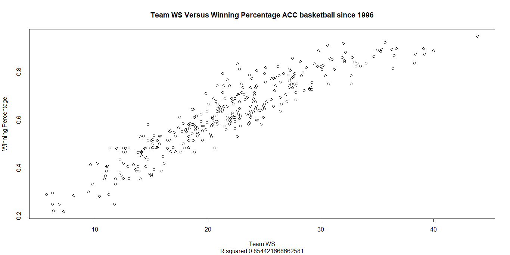

\openup 1em

```{r setup, include=FALSE}
knitr::opts_chunk$set(echo = F, 
                      eval = T,
                      message = F, 
                      warning = F)
#load to display tables
library(pander)
```

```{r, echo = F, eval = T, include=F}
source('~/Honors Thesis/Data Cleaning/Prepping Data for Modeling.R')
```
# First Take
  The goal of this project is to predict collegiate win shares from ESPN recruiting ratings [1] and high school statistics provided by Prep Circuit [2] and AAUStats [3]. As it stands, there is little research on predicting individual players’ collegiate performance. In 2010, Jamie McNeilly used recruiting ranking quartiles to predict PER and other barometers of success [3]; however, the models presented did not consider high school statistics as an input, nor did they consider predicting win shares, which is a more authentic measurement of how a player contributes to overall team success as shown by basketball reference [5].  
Accusations of many NCAA coaches paying high profile recruits hundreds of thousands of dollars to single recruits catalyzed this analysis. If one player can cause decorated coaches to potentially resort to unethical methods, then programs should explore every possible avenue of predicting college performance, especially programs with smaller budgets and less recognition.  
  In addition to benefiting collegiate programs, the methods in this paper could benefit NBA front office decision making. Some high-profile recruits have had mediocre freshman collegiate performances (Harry Giles), or hardly any at all (Michael Porter Jr., Thon Maker), and are still selected in the first round based on their high school evaluations. As NBA teams are investing millions of dollars on players with little to no collegiate data, the methods and data presented in this paper could be used to model NBA performance in conjunction with their collegiate performance.  
  The model with the best out-of-sample error incorporating ESPN Ratings and the two sources of high school statistics. All other models had similar error rates. Future research adjusting for players’ strength of schedule and teammates could significantly improve the models presented in this paper. 

# The Players 
## Basketball Reference
  Every statistic listed on a player’s college basketball reference page was collected; however, only a player’s first season playing in the NCAA was used in the modeling process in order to fairly evaluate a player’s true production out of high school. Due to its all- encompassing nature, win shares represents the dependent variable. Below is a graph of ACC teams’ sum of player win shares plotted against their season winning percentage. 
```{r, echo = F, fig.align = 'center', out.height='100%', out.width='100%'}

```

  College win shares have a weaker relationship with winning than WAR in baseball and in the NBA partially due to large differences in league competition; nonetheless, it is a strong predictor of team success as shown by the above R-squared and basketball reference’s analysis [5]. Other popular basketball metrics such as PER and BPM were plotted against wins as well and had a much lower correlation value than win shares. Additionally, the top players in terms of win shares aligned with the concensus best players over the past few seasons more so than those with the top PER or BPM. Below are the top 10 players in terms of win shares in our data.
```{r, echo = F, eval = T, include=F}
top.ws = data.ws %>% arrange(desc(ws)) %>% select(player.id, ws, Season)
top.10.ws = top.ws[1:10,]
```
`r pander(top.10.ws)`
From a basketball perspective, these players had some of the best freshman seasons over the past few years. Zion in particular has been widely regarded as having the best season from a statistical and basketball perspective. This gives more confidence and validity to win shares as an overall barometer of success.

## ESPN
  The ESPN data gathered contained players’ overall rating from 55 to 100. Only the classes from 2016 to 2018 were used in this analysis due to the lack of Prep Circuit data before the 2016 high school season. In terms of grabbing the basketball reference data, the ESPN data played a critical role. There was no feasible or swift way to accurately gather a high school player’s collegiate win shares without knowing where he went to college, which was not in the Prep Circuit or AAU data. Also gathered from ESPN were players' height, weight, and position. 
  
## Prep Circuit
  
  The high school statistics gathered from Prep Circuit contained regular season averages and totals from box score statistics such as points, points per game, assists, etc. The data is fairly encompassing; however, there appear to be some inaccuracies in the data. For example, Lonzo Ball had 31 games where points were tracked, 4 games for minutes, 22 games for assists steals and turnovers, and 21 games for rebounds. One explanation is that Prep Circuit does not keep track of all statistics for every game. The other hypothesis was that if a player did not log a statistic in a given table, Prep Circuit did not count that towards your game total for that statistic. Upon further inspection, it appeared that the most reliable statistics were the given per game statistics. 
  
## AAUStats  
  
  AAU data was gathered from AAUStats.com [3]. This data contained box scores from Nike, Adidas, and Under Armour circuits from the 2017 to 2019 seasons. There is potential to create more advanced metrics with these box scores, or scaling based on the quality of a player's team or opponent; however, for this analysis, common per game box score statistics akin to Prep Circuit's data were created based on player's final season in all AAU circuits. 
  
  Prior analyses used k nearest neighbor imputation to deal with players missing a given statistic, such as rebounds in Prep Circuit. Below is a table of the number of Prep Circuit players that had points per game, but were missing another per game statistics.
```{r, echo = F, fig.align = 'center'}

Prep_NA_Counts <- read_csv("~/Honors Thesis/Figure and Table Generators/Prep.NA.Counts.csv")
colnames(Prep_NA_Counts)[1] = 'Per Game Statistic'
```
`r pander(Prep_NA_Counts)`
  
  Although this k nearest neighbor imputation was effective for seasons past, it will not be the best method going forward, as the amount and quality of data has improved drastically over the past few years. Below is a table and histogram of the number of players that have each of our data sources by season.
```{r, echo = F}
source("~/Honors Thesis/Figure and Table Generators/Data Availability by Season.R")
```
`r pander(group.freq)`
```{r, echo = F, fig.align = 'center', out.height='80%', out.width='70%'}
data.by.season
```
  
  As shown by the graph above, in 2016, the data sources presented did not even exist. By 2019, most ESPN rated players had both AAU and Prep Circuit statistics. This includes players that are rated poorly. Additionally, by the time this project will complete, the 2019-2020 college basketball season will be over. Their data could be incorporated into the training set or held out as a test set. 
  As shown by the graph above, not every model can be considered on every player as not all players have all sources of information. Using all possible players unfairly favored ESPN models since their sample of players contains many players not talented enough to play in the competitive AAU Circuits or high profile high schools in Prep Circuit. Therefore, only player's with complete information will be considered. Additionally, since many player's only had partial Prep Circuit data, only points per game and the number of games was used in fitting. Other variables were used in some models, but the elimination of some players lacking say blocks per game increased the error rates. In total, there were 185 players used in the models.
  
# Game Plan
  In order to assess the predictive value of high school statistics, models will be constructed using all possible input combinations. The models are the following:
  
  \[M_{AAU}:  \hat{ws} = f_{AAU}(X_{AAU})+ \epsilon\]
  \[M_{PREP}: \hat{ws} = f_{PREP}(X_{PREP}) + \epsilon\]
  \[M_{ESPN}: \hat{ws} = f_{ESPN}(X_{ESPN}) + \epsilon\]
  \[M_{AAU.ESPN}: \hat{ws} = f_{ESPN}(X_{AAU}, X_{ESPN}) + \epsilon\]
  \[M_{PREP.ESPN}: \hat{ws} = f_{ESPN}(X_{PREP}, X_{ESPN}) + \epsilon\]
  \[M_{AAU.PREP}: \hat{ws} = f_{ESPN}(X_{AAU},X_{PREP}) + \epsilon\]
  \[M_{FULL}: \hat{ws} = f_{FULL}(X_{AAU},X_{PREP}, X_{ESPN}) + \epsilon \]
where
\begin{itemize}
\item $\hat{ws}\:is\:the\:predicted\:win\:shares\:of\:a\:given\:player,$
\item  $X_{AAU},\:X_{PREP},\:and\:X_{ESPN}\:are\:the\:data\:matrices\:for\:each\:data\:source,$
\item $f_{AAU},\:f_{Prep},\:f_{ESPN},\:and\:f_{FULL}\:are\:functions\:that\:output\:predicted\:win\:shares,$
\item $\epsilon\:is\:a\:random\:error$
\end{itemize}

  All models were trained through leave one out cross validation. Each player's predicted win shares was outputted from a function fitted on all other players. These values were chosen based on the parameters yielding the smallest out of sample error. The methods and subsequent hyper parameters will be discussed briefly below

\begin{itemize}
\item Lasso
\begin{itemize}
\item Fits a standard linear regression, but shrinks the sum of the absolute value of the coefficients by a value lambda chosen through cross validation.
\end{itemize}
\item Ridge
\begin{itemize}
\item Fits a standard linear regression, but shrinks the sum of squares of the coefficients by a value lambda chosen through cross validation.
\end{itemize}
\item Averaged Neural Network
\begin{itemize}
\item Assigns one or more linear weights to each of the variables depending on the number of input layers (number of variables). The hidden layers are comprised of a linear combination of the input variables. The number of hidden layers is somewhat arbitrarily chosen, in this case, 1/2 of the number of input layers. The final output is a linear combination of the hidden layers, and is then converted into a predicted value through some function, in this case a linear weight was chosen. 200 networks were constructed as such. The final prediction for a player was an average of all such networks. 
\end{itemize}
\item Earth
\begin{itemize}
\item Models non linearaties and interactions by creating one or more hinge functions constructed as h(x-a), where a is the cutoff value for variable x. When x is below a, it is multiplied by a constant b1. When x is greater than a, it is  multiplied by a separate constant b2, and is added to b1. The number of these hinge functions is controlled by a hyper parameter as is the degree (number of interactions and higher order terms).
\end{itemize}
\item Support Vector Machine
\begin{itemize}
\item Builds a hyper plane (a plane or line with dimension of our predictor matrix) that attempts to minimize the distance from the response value. Rather than minimize the total sum of the epsilon's, the hyper plane is fit so that all epsilon's are less than a given cost value, C, found through cross validation. In this case, the non linear predictor space had a lower out of sample error.
\end{itemize}
\item Random Forest
\begin{itemize}
\item Builds n regression trees and creates a prediction based on the average of all of the trees. To reduce correlation between the trees, m random predictors are chosen to construct the tree. M is found through cross validation.
\end{itemize}
\item Gradient Boosted Trees
\begin{itemize}
\item Builds n "weak" regression trees and creates a prediction based on the average of all of the "weak" trees. The trees are pruned by cutting them at a specified "max depth" found through cross validation. For the boosted trees, these hyper-paramaters were chosen through 10 fold cross validation as leave one out lead to over fitting.
\end{itemize}
\item Stacked
\begin{itemize}
\item A full linear regression is performed on all prior predictions using leave one out cross validation.
\end{itemize}
\end{itemize}
  

# Box Score
  There were many variables to consider for these models. Many statistics in the prep data set were not always valid values, and many in both high school data sets or were randomly inaccurate, leading to poor out of sample prediction. Methods were trained through many different combinations of the inputs. Note that some methods were not used for ESPN as they are tailored to data sets with many predictor variables: in this case the ESPN data set is only one variable, ESPN rating. The best models across the board only used the most reliable and predictive statistics. A full linear regression on all variables used in the models is shown below.

## Full Linear Regression Coefficients
```{r}
source("~/Honors Thesis/Data Cleaning/Prepping Data for Modeling.R")
full.2 = full %>% dplyr::select(-dataset)
mod = lm(ws ~ ., data = full.2)
library(knitr)
library(kableExtra)
kable(summary(mod)[4]$coefficients)
```

The most interesting result is that the AAU points per game was not highly significant, but blocks and steals were. This may seem surprising, but many AAU teams are super teams which may lead to individual star players sharing the ball more. In contrast, these same star players may be the only capable scorer on their school teams, leading to high and predictive Prep Circuit points per game. Although the full linear regression performed close to the other methods, it was the worst method across all input combinations. Below are the cross validated R^2s for the different input combinations and models. 

```{r, echo = F, eval = T, include=F}
r2.table = read_csv("~/Honors Thesis/Predictions/All R2 (raw ws LOOCV 5).csv")
colnames(r2.table) = toupper(colnames(r2.table))
colnames(r2.table) = gsub('N=', '(n=', colnames(r2.table), fixed = T)
colnames(r2.table) = gsub('185', '185)', colnames(r2.table), fixed = T)

r2.table[,2:ncol(r2.table)] = round(r2.table[,2:ncol(r2.table)]*100, 1)
r2.table[is.na(r2.table[,2]),2] = 0
paster = function(x){
  return(paste(x, '%', sep = ''))
  
}
r2.table[,2:ncol(r2.table)] = apply(X = r2.table[,2:ncol(r2.table)], MARGIN=2, FUN = paster)
colnames(r2.table)[1] = 'Method'
r2.table = as.data.frame(r2.table)
r2.table[,2] = gsub('0%', '', r2.table[,2], fixed = T)


lm.table = read_csv("~/Honors Thesis/Predictions/All R2 (linear).csv")
lm.table[,2:ncol(lm.table)] = round(lm.table[,2:ncol(lm.table)]*100, 1)
lm.table[is.na(lm.table[,2]),2] = 0
paster = function(x){
  return(paste(x, '%', sep = ''))
  
}
lm.table[,2:ncol(lm.table)] = apply(X = lm.table[,2:ncol(lm.table)], MARGIN=2, FUN = paster)
colnames(lm.table)[1] = 'Method'
lm.table = as.data.frame(lm.table)
lm.table[,2] = gsub('0%', '', lm.table[,2], fixed = T)
```

## Percentage of Variance Explained by the Models
```{r}
#pandoc.table(lm.table, style = 'rmarkdown')
lm = c('lm', t(lm.table)[2:length(lm.table)])
full.table = rbind(lm, r2.table)
full.table[,1] = c('Linear', 
                   'Averaged Neural Network',
                   'Lasso',
                   'Ridge',
                   'Random Forest',
                   'Earth',
                   'Support Vector Machine',
                   'Gradient Boosted Trees',
                   'Stacked')
full.table[7, 2] =cell_spec(full.table[7,2], bold = T)
full.table[9, 5] =cell_spec(full.table[9,5], bold = T)
kable(full.table[,1:5], format = 'markdown')
kable(full.table[c(1,6,7,8)], format = 'markdown')
```


The first interesting result is that the ESPN models are generally better than the Prep and AAU models. The best ESPN model explains almost 10% more variation than the best Prep model. When forecasting prospect performance, 10% is a huge performance boost. It should be noted, that the best ESPN model is a radial support vector machine, indicating the presence of non linearities. In short, there is a larger difference in expected wins for a team between securing a top 10 prospect versus top 20, as opposed to a top 20 versus a top 20 player. 
However, this difference should not discount the usefulness of the high school statistics. on their own, the Prep Circuit and AAU models were able to explain 23% and 21% of the variation respectively; moreover, models incorporating the ESPN ratings and high school statistics performed even better, with the best model explaining 37.4% of the variation, 4% better than the non linear ESPN model, and 14% better than the basic linear ESPN model which could be viewed as the 'conventional approach'.
To illustrate how this predictive advantage could be used, the plot below shows the difference in absolute error between the best full model and the best ESPN model. Negative values mean the full model had a smaller error compared to the ESPN model and positive values mean the ESPN model performed better. In the graph below, values to the left of the vertical line indicate negative values, where the full models performed better. The x axis is the actual win shares.

## Residuals for Best ESPN Model Versus Best Stacked Model
```{r}
load("~/Honors Thesis/Model Environments/All Predictions (raw ws LOOCV 5).RData")


source('~/Honors Thesis/Data Cleaning/Prepping Data for Residual Analysis.R')


full$full.error = full$ws - full.pred.stacked
full$espn.error = full$ws - espn.pred.svm

full$full.fitted = full.pred.stacked

full$espn.fitted = espn.pred.svm

full$abs.error.dif = abs(full$full.error) - abs(full$espn.error)

full = full %>% dplyr::select(
  player.id,
  ws,
  full.fitted,
  espn.fitted,
  abs.error.dif,
  full.error,
  espn.error,
  everything()
)
ggplot(full, aes(x = abs.error.dif,
                 y = ws,
                 label = player.id)) +
geom_text(aes(label=player.id),hjust=0, vjust=0,
          size = 3) +
  geom_point(colour = 'blue') +
  ylab('Win Shares') +
  geom_hline(yintercept = 0) +
  geom_vline(xintercept = 0) +
  guides(fill=guide_legend(title="ESPN Rating")) + 
   ylim(-1, 8.5) +
  xlim(-2, 2)  +
  xlab('Difference between Full Error and ESPN Error')  + theme_bw()

```

As shown by the above graph, there were several players that the full model out projected the ESPN model by one or more win shares. In the most extreme example, the full model out projected Deandre Ayton by almost two win shares compared to the ESPN model. Other large differences favoring the full model are Quentin Grimes, Ryan Layman, and Trae Young. 

Most of the players that the ESPN model predicted substantially better on (more than 1 win share) ended up having very low win shares and a low ESPN rating. The three players favoring the ESPN model the most: KJ Davis, Shandon Brown, and Bailey Patella all had an ESPN rating of 64. They also played very few games in the Prep Circuit data: 2, 6, and 6 respectively, where the median Prep Circuit games played was 11 and the average was 11.27. These are not huge outliers, but they are on the lower end of the dataset. More years of data, improved reliability, and more analysis could improve the existing performance boost shown by incorporating all information.

# Last Take
It is important to judge the data and its predictive accuracy with some perspective. Original modeling with relatively new high school statistics improved upon a rating system that has been bettering itself for 13 years. The information used was also only box score statistics which does not paint the full picture of the game. Even in baseball where statistical modeling in sports is an integral part of the process, the best projection systems incorporate scouting and statistics, and the statistics only models rarely beat the combined models despite the individual aspect to baseball.
This finding should encourage more analysis and collection of high school data not only for the collegiate level, but at the professional level, where one draft pick can change a franchise for decades. If this data holds predictive value at the collegiate level, there is reason to believe it can assist an NBA projection system, particularly in cases where a high school superstar falters or gets injured in college or on the flip side, a low rated recruit explodes onto the scene. Although the improvements shown by the models and data are small relative to the amount of statistical analysis, in 13 years the reliability and robustness of the data will improve the models substantially.

# Appendix
## Linear Weights for Full Stacked Model
```{r}
#load("~/Honors Thesis/Model Environments/All Predictions (LOOCV 5).RData")
load("~/Honors Thesis/Model Environments/full stacked.RData")
summary(mod)
```

# References 
[1]	"ESPN Basketball Recruiting - Player Rankings", ESPN. [Online]. Available: 
http://www.espn.com/collegesports/basketball/recruiting/playerrankings/_/class/2016/order/true. [Accessed: 26- Mar- 2019]. 

[2]	"Statistics - 2015-2016 Regular Season - HS Circuit", Prep Circuit. [Online]. Available: 
https://www.prepcircuit.com/stats/league_instance/34558?subseason=245525. [Accessed: 01- Apr- 2019].

[3]"AAUStats", Aaustats.com, 2019. [Online]. Available: http://aaustats.com/. [Accessed: 13- Dec- 2019].

[4]	J. McNeilly, "Prediction Versus Production: Examining the Relationship Between NCAA Division I Ranked Recruits and their Ensuing Athletic Production in 
College", Epublications.marquette.edu, 2010. [Online]. Available: https://epublications.marquette.edu/cgi/viewcontent.cgi?article=1013&context=cps_profe ssional. [Accessed: 04- Apr- 2019]. 

[5]	"Calculating Win Shares", Sports Reference. [Online]. Available: https://www.sportsreference.com/cbb/about/ws.html. [Accessed: 04- Apr- 2019]. 


